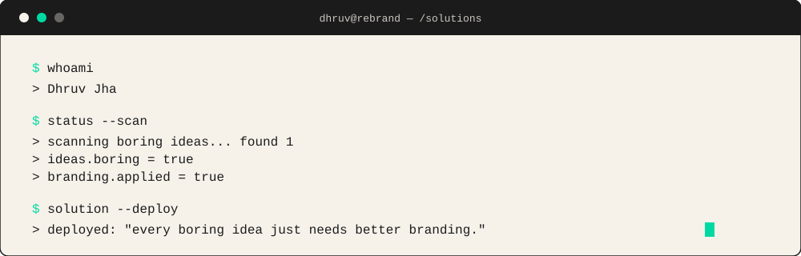
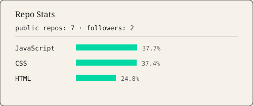
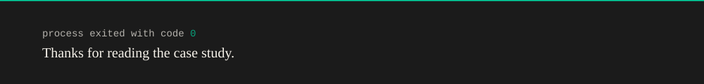

<p align="center">
  
</p>

<p align="center">
  <picture>
    <source media="(prefers-color-scheme: dark)" srcset="./assets/header-dark.svg">
    <source media="(prefers-color-scheme: light)" srcset="./assets/header-light.svg">
    
  </picture>
</p>

<br/>

### Quick Facts

| | |
|---|---|
| **Role** | Digital Marketer & Business Student |
| **Building with** | SEMrush · Google Analytics · Figma · Canva · Git · GitHub · HTML · CSS · JavaScript · React · Node.js · Tailwind CSS |
| **Working hours** | 6 PM – 2 AM IST |
| **Status** | Digital Marketer \| Open to learning, collaborations & opportunities |
| **Contact** | <a href="mailto:jhasagar92534@gmail.com">jhasagar92534@gmail.com</a> |

<br/>

### Toolkit

<p>
  
  
  
  
  <br/>
  
  
  
  
  <br/>
  
  
  
  
</p>

<br/>

### GitHub Stats



<br/><br/>

### Coding Clock

Real commit activity by hour (IST), pulled from public push events and refreshed daily by a scheduled GitHub Action — not static numbers.

<!--START_SECTION:owl-->
```text
🌞 Morning      2 commits     █░░░░░░░░░░░░░░░░░░░░░░░░   5.88%
🌆 Daytime      7 commits     █████░░░░░░░░░░░░░░░░░░░░   20.59%
🌃 Evening     10 commits     ███████░░░░░░░░░░░░░░░░░░   29.41%
🌙 Night       15 commits     ███████████░░░░░░░░░░░░░░   44.12%
```
<!--END_SECTION:owl-->

<br/>

<p align="center">
<summary>Contribution Snake</summary>
<br/>
<picture>
  <source media="(prefers-color-scheme: dark)" srcset="https://raw.githubusercontent.com/dhruvsketch/dhruvsketch/output/snake-dark.svg" />
  
</picture>
<p align="center">

<br/>

### Connect

<p>
  <a href="https://github.com/dhruvsketch"></a>
  <a href="https://www.linkedin.com/in/dhruv-jha-b24394325"></a>
  <a href="https://www.instagram.com/dhruvjha.26"></a>
  <a href="mailto:jhasagar92534@gmail.com"></a>
</p>

<!--METRICS-UPDATED:START-->_Last updated 2026-08-16 18:31 UTC_<!--METRICS-UPDATED:END-->

<br/>

<p align="center">
  
</p>
